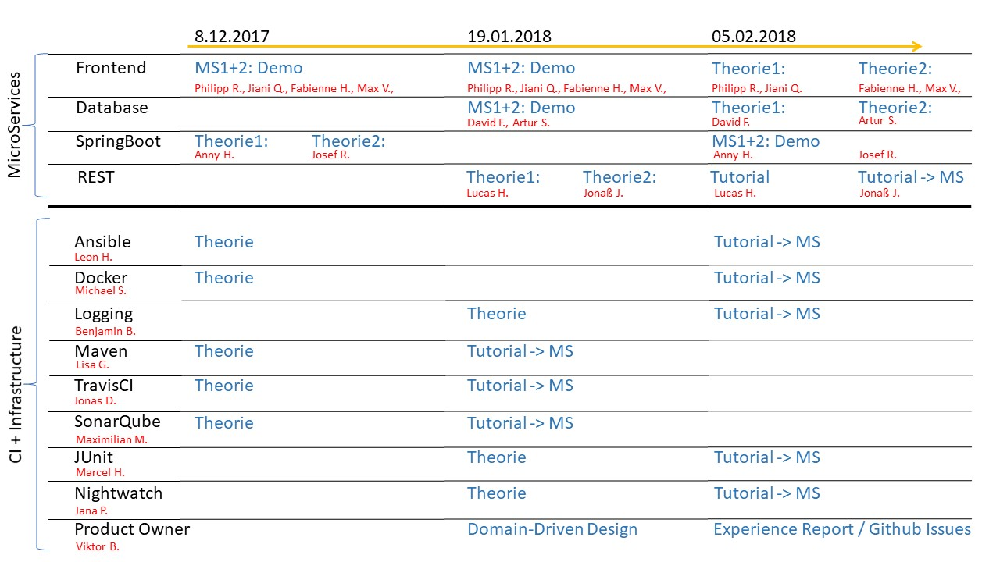

# Ferienpass-Planning
Overview of requirements, architecture, and tasks for digitalizing ferienpass-weimar.de

Note: We will have our first milestone meeting at room 003 at the Berkaer Straße 1.

## Project Resources

Use [our Slack-Channel](https://digital-bauhaus.slack.com) to collaborate with your peers or with [Prof. Dr. Nobert Siegmund](https://twitter.com/Norbsen) / [Jonas Hecht](https://twitter.com/jonashackt)

[Invitation link to Slack](https://join.slack.com/t/digital-bauhaus/shared_invite/enQtMjYxNzcyMjI5Nzk4LWNlNTc1MTljZDcyOWJjYjM1NmFiZDMyMDM3ZjI0MTRmZGFlOTk1MDY1ODZiM2MxNDY4NTBlM2JiYzQ5OGU3NDg)

Slides about [Motivation, Grading, ...](/slides/1_motivation.pdf)

## How to Find References for the Presentation, Implementation, and Tutorial
- Google: Topic + Tutorial / Guide / Video / Intro / Example
- Stackoverflow: In case of problems
- Youtube: Topic + 15min Introduction / Tutorial
- Developer blogs
- Github repos

## Concrete Tasks and Time Schedule (in progress... changes may apply)

### MicroService 1: Anmeldung
- **Frontend** Philipp R. & Jiani Q.:
  - ~~**08.12.2017:** Demonstrate the frontend of the most essential functions (defined in collaboration with the product owner)~~
  - **19.01.2017:** Final demonstration of all realized functions at the frontend
  - **05.02.2017:** Theory -> Overview of Web Development Process with JS: Nodes.js + NPM + ECMAScript + Web pack? 

- ~~**REST** Lucas	H.
  - **19.01.2017:** Theory -> SpringBoot with REST: How to realize REST Services? What does @RESTController do? How does it work? Given an introduction.
  - **05.02.2017:** Tutorial: What do you have to do to get things started? Make a simple but good tutorial for your collegues.~~
  
- **SpringBoot** Anny	H. 
  - ~~**08.12.2017:** Theory -> Give an overview about SpringBoot. Why is it important? What is Auto Conf? What are the starter POMs (Maven Integration)? What means convention over configuration?~~
  - **05.02.2017:** Tutorial: Give an tutorial about setting up a MicroService with SpringBoot.
  
- **Datenbank** David	F. 
  - **19.01.2017:** (in collaboration with MS2 Artur S.) Demonstration: How are the database schema and the database commands been realized in both MicroServices? How did you implement the requirements?
  - **05.02.2017:** (30min!) Theory -> What is CQRS Pattern + Event Sourcing? Give an intro and why it is important. Provide a small tutorial or code examples.

### MicroService 2: Administration
- Frontend Max	V. & Fabienne	H.
  - ~~**08.12.2017:** Demonstrate the frontend of the most essential functions (defined in collaboration with the product owner)~~
  - **19.01.2017:** Final demonstration of all realized functions at the frontend
  - **05.02.2017:** Theory of Vue.js -> What is it? Why is it good? What are the important features? How to get started?

- **REST** Jonas	L. 
  - **19.01.2017:** Theory -> History about distributed system communication (e.g., Middleware, Java RMI). What is now different with REST? What is REST about? How does it work?
  - **05.02.2017:** Demonstration: How does it work in the MicroService? What is the relation to the database and frontend?

- **SpringBoot** Josef	R. 
  - ~~**08.12.2017:** Theory -> What are SpringBoot metrics? What can they show us and why are they important?~~
  - **05.02.2017:** Demonstration: How to set up SpringBoot Metrics in the MicroService? Show how to get metrics running for the MicroService.

- **Datenbank** Artur	S. 
  - **19.01.2017:** (in collaboration with MS1 David F.) Demonstration: How are the database schema and the database commands been realized in both MicroServices? How did you implement the requirements?
  - **05.02.2017:** (30min!) Theory -> What is an Object-Relation Mapper (OR-Mapper)? What is Hybernate and JPA? How does it work? Give an overview with code examples.

### Continuous Integration & Infrastructure
- **Ansible** Leon	H.
  - ~~**08.12.2017:** Theory ->  What is infrastructure as code and why is it important? What is Ansible?~~
  - **05.02.2017:** Tutorial: Show how to write an Ansible file by setting up the environment for the MicroSerivce we used and deploying it.
- **Docker** Michael	S.
  - ~~ **08.12.2017:** Theory -> What is Docker? Why is it different to vitual environments? How is Docker used for MicroServices? ~~
  - **05.02.2017:** Tutorial: Show how to write a Docker file and how to use existing Docker files. Show the example by embedding an MicroService into a Docker Container.
- **Logging** Benjamin	B.
  - **19.01.2017:** Theory -> What is SLF4J? What is LogBack? How to realize the logging stack (from code to analysis) of MicroServices?
  - **05.02.2017:** Tutorial: Show how to set up Logging in the MicroServices we used and how to analyze them.
- **Maven** Lisa	G.
  - **19.01.2017:** Theory -> What are build tools? What is Maven? Why is Maven so special?
  - **05.02.2017:** Tutorial: Show how to create simple POM files and explain the POM-files we are using in the MicroServices.
- **TravisCI** Jonas	D.
  -~~**08.12.2017:** Theory -> What is continuous integration? What is Travis CI?~~
  - **19.01.2017:** Tutorial: Show how to set up Travis CI support for the two MicroServices and present some results of the development process using Travis CI.
- ~~**SonarQube** Maximilian	M.
  - **08.12.2017:** Theory -> What is SonarQube? Why is it and other approaches, such as Coveralls important? 
  - **19.01.2017:** Tutorial: Show how to set up SonarCloud and demonstrate analyses based on the two MicroServices.~~
- **JUnit** Marcel	H.
  - **19.01.2017:** Theory -> What is JUnit? What features are new to version 5? What are good practices?
  - **05.02.2017:** Tutorial: Show how to create Unit Tests and what tests you and others have been created for the MicroServices.
- **Nightwatch** Jana	P.  
  - **19.01.2017:** Theory -> How to test Web pages? What is Nightwatch? Why is it important? 
  - **05.02.2017:** Tutorial: Show how to set up tests for the frontend using one or both MicroServices.
- **Product Owner** Viktor	B.
  - **19.01.2017:** Theory -> What is domain-driven design? Give an overivew with examples.
  - **05.02.2017:** Report: Provide an experience report about handling the issues and selecting important ones. Also, demonstrate how to properly use GitHub issues.
