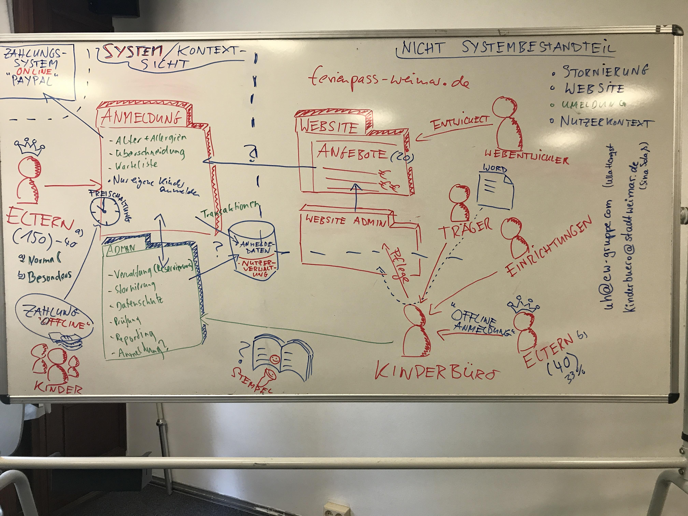

# Ferienpass-Planning
Overview of requirements, architecture, and tasks for digitalizing ferienpass-weimar.de

## Project Resources

Use [our Slack-Channel](https://digital-bauhaus.slack.com) to collaborate with your peers or with [Prof. Dr. Nobert Siegmund](https://twitter.com/Norbsen) / [Jonas Hecht](https://twitter.com/jonashackt)

[Invitation link to Slack](https://join.slack.com/t/digital-bauhaus/shared_invite/enQtMjYxNzcyMjI5Nzk4LWNlNTc1MTljZDcyOWJjYjM1NmFiZDMyMDM3ZjI0MTRmZGFlOTk1MDY1ODZiM2MxNDY4NTBlM2JiYzQ5OGU3NDg)

Slides about [Motivation, Grading, ...](/slides/1_motivation.pdf)

## How to Find References for the Presentation, Implementation, and Tutorial
- Google: Topic + Tutorial / Guide / Video / Intro / Example
- Stackoverflow: In case of problems
- Youtube: Topic + 15min Introduction / Tutorial
- Developer blogs
- Github repos

## Concrete Tasks and Time Schedule (in progress... changes may apply)

### MicroService 1: Anmeldung
- Philipp	R. Frontend
- Jiani	Q. Frontend
- Lucas	H. REST
- Anny	H. Spring Boot
- David	F. Datenbank

### MicroService 2: Administration
- Max	V. Frontend
- Fabienne	H. Frontend
- Jonas	L. REST
- Josef	R. Spring Boot
- Artur	S. Datenbank

### Continuous Integration & Infrastructure
- Jonas	D. TravisCI
- Viktor	B. Product Owner
- Jana	P. Nightwatch
- Benjamin	B. Logging
- Leon	H. Ansible
- Michael	S. Docker
- Maximilian	M. SonarQube
- Lisa	G. Maven
- Marcel	H. JUnit
